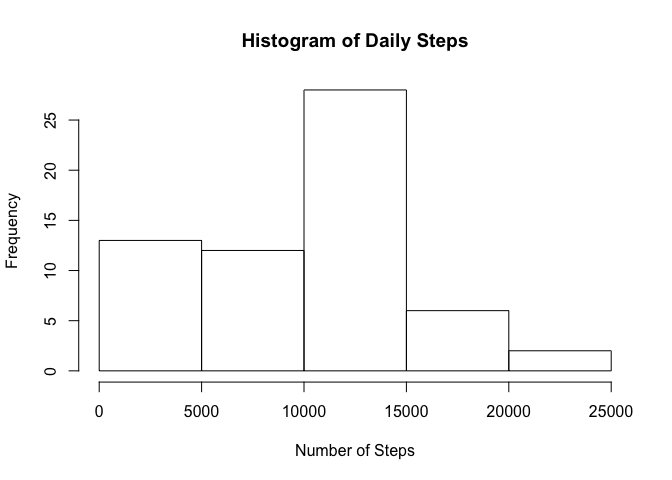
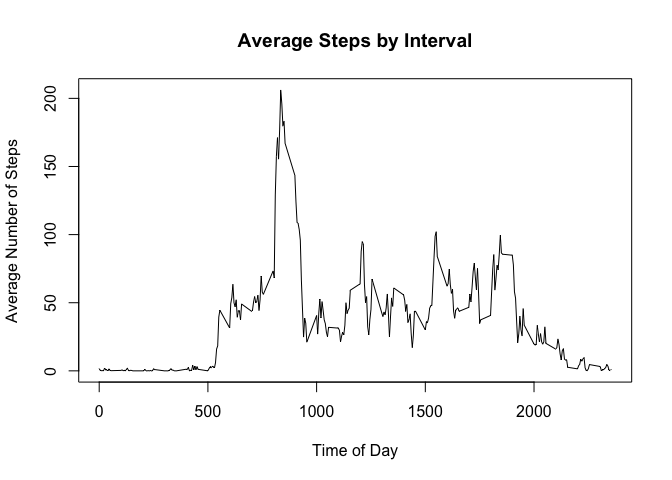
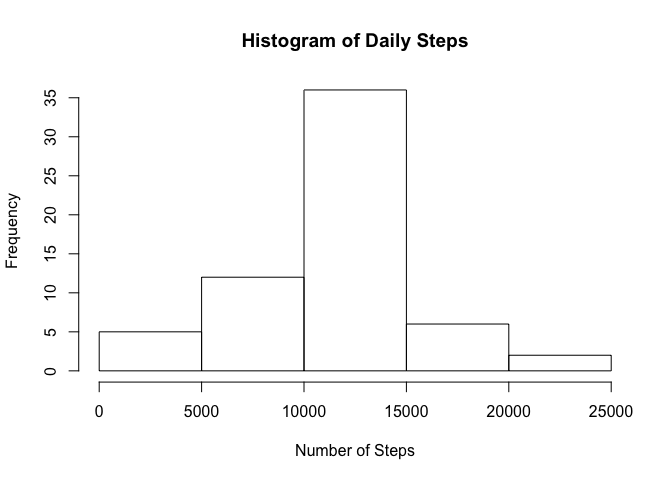
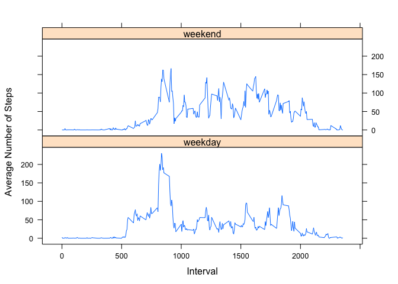

# Reproducible Research: Peer Assessment 1

Set global options and load libraries.

```r
knitr::opts_chunk$set(echo = TRUE)
library(xtable)
library(dplyr)
```

```
## 
## Attaching package: 'dplyr'
```

```
## The following objects are masked from 'package:stats':
## 
##     filter, lag
```

```
## The following objects are masked from 'package:base':
## 
##     intersect, setdiff, setequal, union
```

```r
library(lattice)
```


## Loading and preprocessing the data

Read the data in and convert it into a data frame tbl.

```r
data <- read.csv(unz("activity.zip", "activity.csv"), stringsAsFactors = FALSE)
data <- tbl_df(data)
```


## What is mean total number of steps taken per day?

Calculate the total number of steps taken per day. Make a histogram of the
total number of steps taken each day. 


```r
by_day <- 
    data %>%
    group_by(date) %>%
    summarize(steps=sum(steps, na.rm=TRUE))
hist(by_day$steps, xlab="Number of Steps", 
     main="Histogram of Daily Steps")
```

<!-- -->

Calculate and report the mean and the median of the total number of steps 
taken per day.

```r
xt <- xtable(summarize(by_day, mean(steps), median(steps)))
print(xt, type = "html")
```

<!-- html table generated in R 3.3.0 by xtable 1.8-2 package -->
<!-- Mon Jun 27 14:07:21 2016 -->
<table border=1>
<tr> <th>  </th> <th> mean(steps) </th> <th> median(steps) </th>  </tr>
  <tr> <td align="right"> 1 </td> <td align="right"> 9354.23 </td> <td align="right"> 10395 </td> </tr>
   </table>

## What is the average daily activity pattern?

Create a time series plot of the 5-minute interval (x-axis) and the average
number of steps taken across all days (y-axis).

```r
by_interval <- 
    data %>%
    group_by(interval) %>%
    summarize(steps=mean(steps, na.rm=TRUE))
with(by_interval, plot(interval, steps, type = "l",
     xlab="Time of Day",
     ylab="Average Number of Steps", 
     main="Average Steps by Interval"))
```

<!-- -->

Which 5-minute interval, on average across all the days in the dataset,
contains the maximum number of steps?

```r
max_steps <- max(by_interval$steps)
filter(by_interval, steps >= max_steps)
```

```
## Source: local data frame [1 x 2]
## 
##   interval    steps
##      (int)    (dbl)
## 1      835 206.1698
```

## Imputing missing values

Calculate the total number of missing values in the dataset (i.e. the total
number of rows with NAs).

```r
data %>%
    filter(is.na(steps)) %>%
    summarize(n())
```

```
## Source: local data frame [1 x 1]
## 
##     n()
##   (int)
## 1  2304
```

Create a new column, imputed_steps, which will replace missing values in steps 
with the mean for the 5-minute interval across the rest of the dataset.

```r
data_imputed <-
    data %>%
    left_join(select(by_interval, interval, imean=steps)) %>%
    mutate(imputed_steps = ifelse(is.na(steps), imean, steps))
```

```
## Joining by: "interval"
```

Create a histogram of the total number of steps.

```r
by_day_imputed <- 
    data_imputed %>%
    group_by(date) %>%
    summarize(steps=sum(imputed_steps, na.rm=TRUE))
hist(by_day_imputed$steps, xlab="Number of Steps", 
     main="Histogram of Daily Steps")
```

<!-- -->

Calculate and report the mean and the median of the total number of steps 
taken per day.

```r
xt <- xtable(summarize(by_day_imputed, mean(steps), median(steps)))
print(xt, type = "html")
```

<!-- html table generated in R 3.3.0 by xtable 1.8-2 package -->
<!-- Mon Jun 27 14:07:21 2016 -->
<table border=1>
<tr> <th>  </th> <th> mean(steps) </th> <th> median(steps) </th>  </tr>
  <tr> <td align="right"> 1 </td> <td align="right"> 10766.19 </td> <td align="right"> 10766.19 </td> </tr>
   </table>

Do these values differ from the estimates from the first part of the 
assignment? It turns out that all of the missing 
data is aligned along day boundaries. For each day, we should see 288 
observations. By filtering to the records containing NA values and then 
doing a count by day, we see that we have 8 full days of data missing. 
Thus, the histogram sees a shift of 8 records from the 0-5000 bucket to the 
10000-15000 bucket. Both the mean and median are shifted to higher values.


```r
data %>% filter(is.na(steps)) %>% group_by(date) %>% summarize(n())
```

```
## Source: local data frame [8 x 2]
## 
##         date   n()
##        (chr) (int)
## 1 2012-10-01   288
## 2 2012-10-08   288
## 3 2012-11-01   288
## 4 2012-11-04   288
## 5 2012-11-09   288
## 6 2012-11-10   288
## 7 2012-11-14   288
## 8 2012-11-30   288
```

## Are there differences in activity patterns between weekdays and weekends?

Create a new factor variable in the dataset with two levels - "weekday" and 
"weekend" indicating whether a given date is a weekday or weekend day.

```r
by_weekday <-
    data_imputed %>%
    mutate(date = as.Date(date),
           weekday = weekdays(date),
           daytype = factor(ifelse(weekday %in% c('Sunday', 'Saturday'),
                                   "weekend",
                                   "weekday"))) %>%
    group_by(daytype, interval) %>%
    summarize(steps = mean(imputed_steps))
```

Make a panel plot containing a time series plot of the 5-minute 
interval (x-axis) and the average number of steps taken, averaged across all
weekday days or weekend days (y-axis).

```r
xyplot(steps ~ interval | daytype, 
       data = by_weekday, 
       type = "l", layout = c(1,2),
       xlab = "Interval",
       ylab = "Average Number of Steps")
```

<!-- -->
